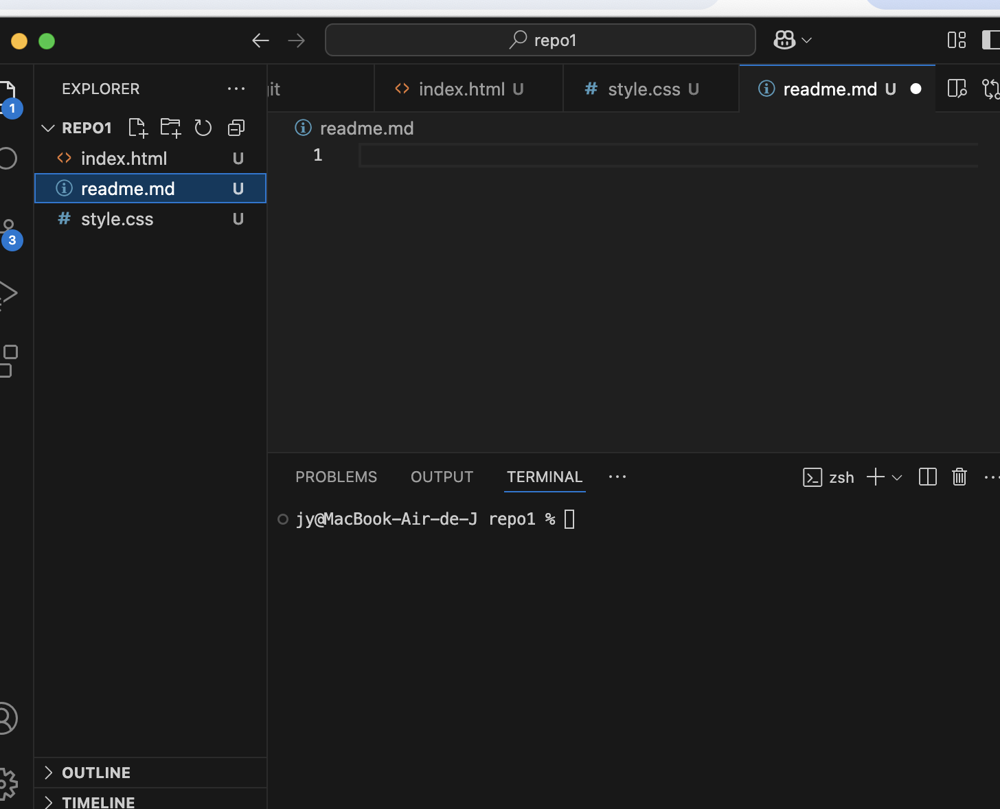

Como inicializar repo 
Como subir cambios a git 
1. git add .
2. git commit -m "Comentario explicativo de la subida"
3. git push origin main 

<h5>Apuntes</h5>
<h6>Terminal</h6>
Cuando poones en el terminal .. significa volver a la carpeta anterior 